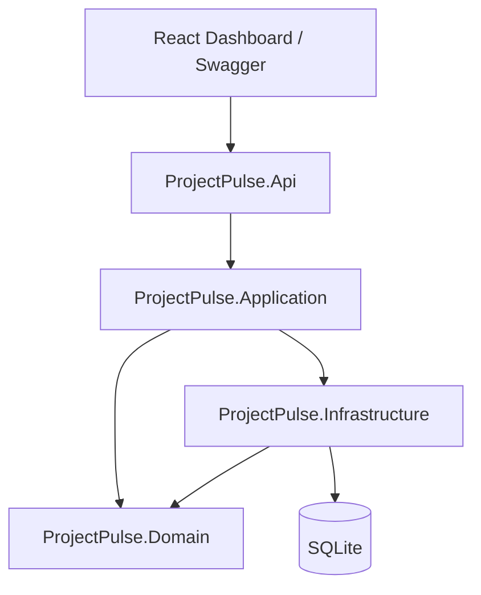
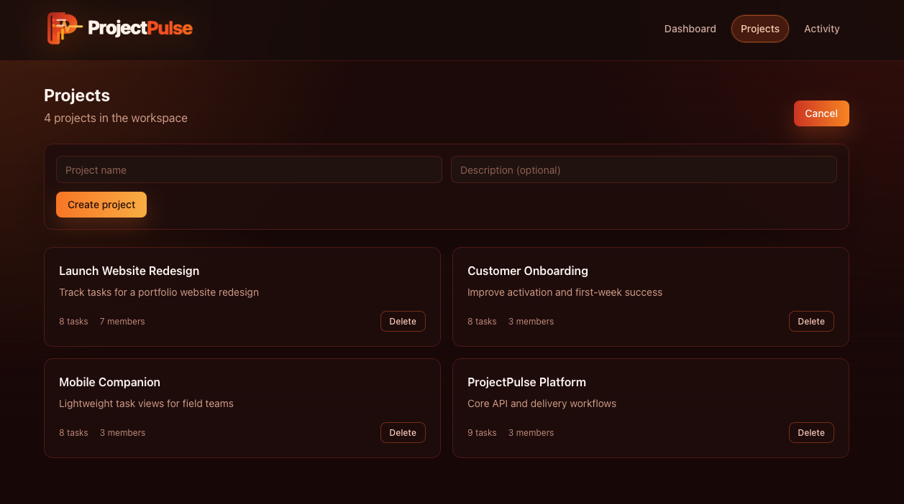
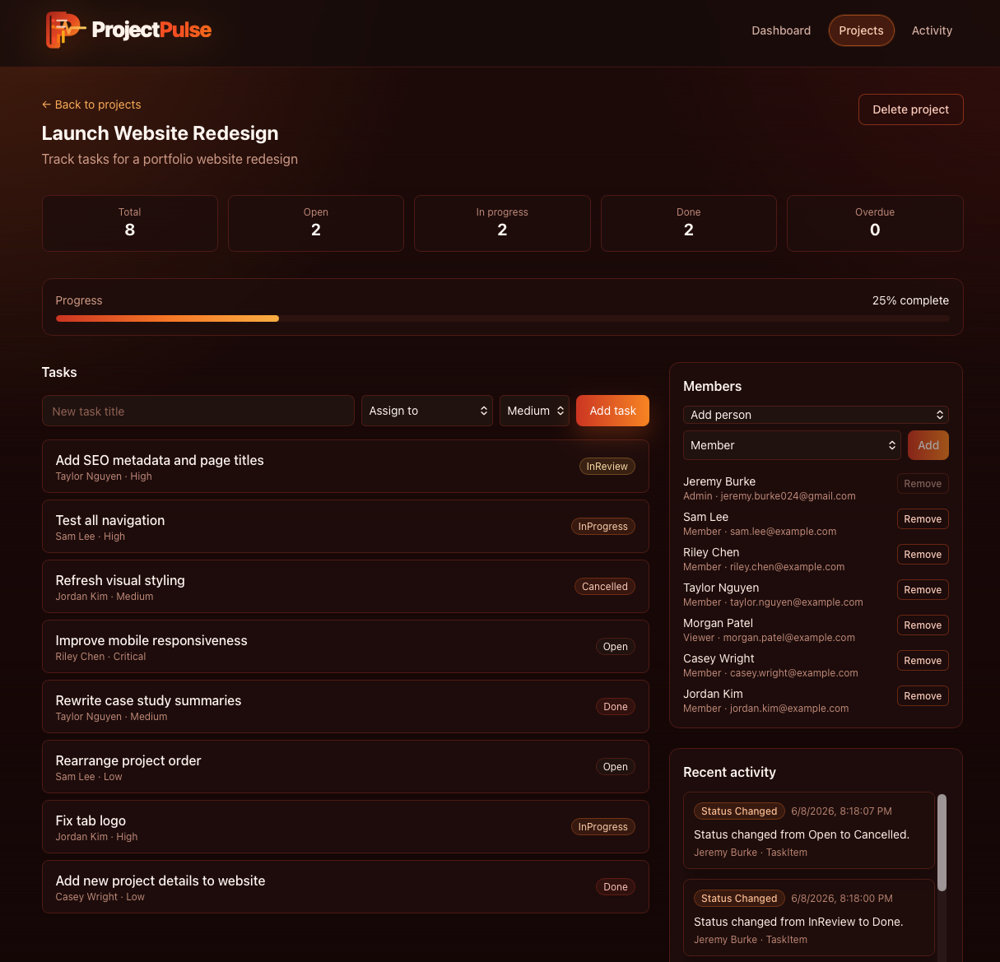
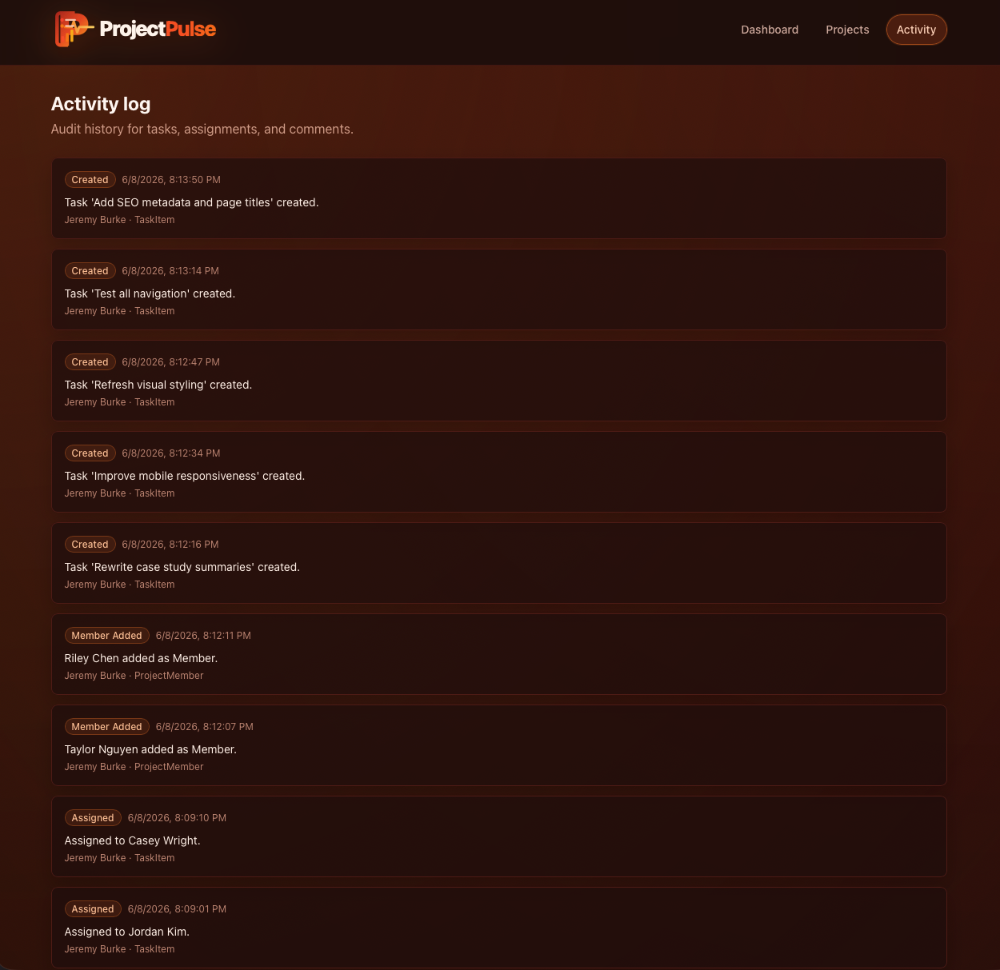
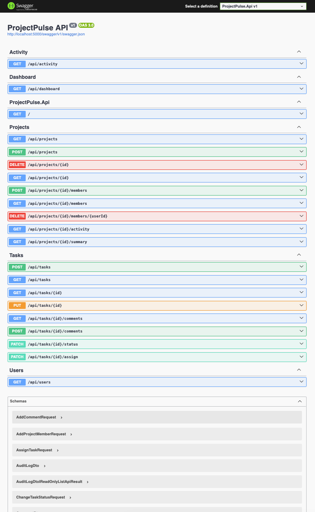

# ProjectPulse

ProjectPulse is a portfolio project-management system built with an **ASP.NET Core 8 Clean Architecture API** and a **React/Vite dashboard**. It demonstrates a realistic project/task workflow with project membership, task assignment, status transitions, comments, audit history, Swagger documentation, and automated tests.

The backend is the core of the project. The frontend is a polished demo client that makes the API workflow easy to review locally.

## What This Demonstrates

* Clean Architecture boundaries: `Domain`, `Application`, `Infrastructure`, and `Api`
* CQRS-style commands and queries with MediatR
* FluentValidation request validation and centralized exception handling
* EF Core persistence with SQLite for local development
* Domain rules for task status transitions and project membership permissions
* Required task assignment to a project member when creating tasks
* Project member management, including add/remove member workflows
* Last-admin protection when removing project members
* Automatic task unassignment when a removed member had assigned tasks
* Audit logging for projects, tasks, comments, assignments, and membership changes
* Swagger/OpenAPI for direct API exploration
* React dashboard with project, task, member, and activity workflows
* Unit and integration tests with CI-ready commands

## Tech Stack

| Layer | Technologies |
| --- | --- |
| API | ASP.NET Core 8 Web API, Swagger/OpenAPI |
| Application | MediatR, FluentValidation |
| Domain | Entities, enums, domain rules |
| Infrastructure | EF Core, SQLite |
| Frontend | React, TypeScript, Vite, Tailwind CSS, TanStack Query |
| Tests | xUnit, FluentAssertions, WebApplicationFactory |
| DevOps | Docker Compose, GitHub Actions |

## Architecture



## Demo Screenshots

### Projects And Project Creation

The Projects page lists seeded and user-created projects, shows task/member counts, supports project deletion, and includes the create-project form.



### Project Detail, Tasks, And Members

Project detail pages show project metrics, progress, task creation, task status, required assignee selection, members, recent activity, and member management controls. Members can be added with a role and removed from the project. Removing a member also unassigns their project tasks.



### Task Detail Drawer

The task drawer supports title, description, status, priority, due date, assignee changes, and comments. Status options are constrained by the domain transition rules.


### Activity Log

The Activity page shows audit-style history for task creation, assignment, status changes, comments, and project member changes.



### Swagger/OpenAPI

Swagger exposes the raw API contract for Projects, Tasks, Activity, Dashboard, and Users endpoints.



## Core Workflows

* Create projects with a name and optional description.
* View project task counts, status summary, progress, and recent activity.
* Add members to a project as `Admin`, `Member`, or `Viewer`.
* Remove project members while protecting the final admin.
* Create tasks only after selecting a project member assignee.
* Edit task title, description, priority, due date, and assignee.
* Move tasks through allowed status transitions.
* Add comments to tasks.
* Review audit history across project and workspace activity feeds.
* Inspect and test endpoints directly through Swagger.

## Run Locally

### 1. API

Prerequisite: [.NET 8 SDK](https://dotnet.microsoft.com/download/dotnet/8.0)

From the repository root:

```bash
dotnet restore
dotnet run --project src/ProjectPulse.Api
```

* Swagger: **http://localhost:5000/swagger**
* API base: **http://localhost:5000**

Or with Docker:

```bash
docker compose up --build api
```

### 2. Frontend Dashboard

Prerequisite: [Node.js 20+](https://nodejs.org/)

The frontend `package.json` is inside `frontend/`, so run npm commands from that directory:

```bash
cd frontend
npm install
npm run dev
```

* Dashboard: **http://localhost:5173**

The Vite dev server proxies `/api` to `http://localhost:5000`.

## Demo Flow

1. Start the API and frontend.
2. Open the dashboard and review workspace metrics.
3. Open the Projects page and create a project.
4. Open a project detail page and add project members.
5. Create a task by entering a title, selecting an assignee, and choosing a priority.
6. Open a task to update status, priority, due date, assignee, and comments.
7. Remove a project member and confirm their assigned project tasks become unassigned.
8. Open Activity to review audit entries for tasks, assignments, and membership changes.
9. Open Swagger to inspect and test the raw API endpoints.
10. Run the test suite.

## API Highlights

```bash
# List projects
curl http://localhost:5000/api/projects

# Create a project
curl -X POST http://localhost:5000/api/projects \
  -H "Content-Type: application/json" \
  -d '{"name":"Sprint 42","description":"Q2 delivery"}'

# Add a project member
curl -X POST http://localhost:5000/api/projects/{projectId}/members \
  -H "Content-Type: application/json" \
  -d '{"userId":"{userId}","role":"Member"}'

# Create an assigned task
curl -X POST http://localhost:5000/api/tasks \
  -H "Content-Type: application/json" \
  -d '{"projectId":"{projectId}","title":"Build task workflow","description":null,"priority":"High","assigneeId":"{userId}","dueDateUtc":null}'

# Change task status
curl -X PATCH http://localhost:5000/api/tasks/{taskId}/status \
  -H "Content-Type: application/json" \
  -d '{"status":"InProgress"}'

# Assign or unassign a task
curl -X PATCH http://localhost:5000/api/tasks/{taskId}/assign \
  -H "Content-Type: application/json" \
  -d '{"assigneeId":"{userId}"}'

# Remove a project member
curl -X DELETE http://localhost:5000/api/projects/{projectId}/members/{userId}

# Project summary and activity
curl http://localhost:5000/api/projects/{projectId}/summary
curl http://localhost:5000/api/projects/{projectId}/activity
```

## Authorization Note

This demo uses a development current-user service with a seeded admin user for local workflows. Project membership rules are still enforced in the application layer: only admins can manage members, and only admins or members can manage tasks. JWT authentication and role-based authorization are planned for a future version.

## Tests

```bash
dotnet test
```

The test suite includes unit tests for domain/application behavior and integration tests for API workflows such as project deletion, task updates, status changes, and project member add/remove behavior.

## CI

GitHub Actions runs restore, build, and test checks on every push to `main`.

## Project Structure

```txt
src/
  ProjectPulse.Api/
  ProjectPulse.Application/
  ProjectPulse.Domain/
  ProjectPulse.Infrastructure/

tests/
  ProjectPulse.UnitTests/
  ProjectPulse.IntegrationTests/

frontend/
  React + Vite + Tailwind dashboard

readme_images/
  Demo screenshots used in this README
```

## Planned Improvements

* JWT authentication and production-ready authorization
* Role editing for existing project members
* Kanban-style task board
* More detailed dashboard charts
* Optional hosted demo deployment
