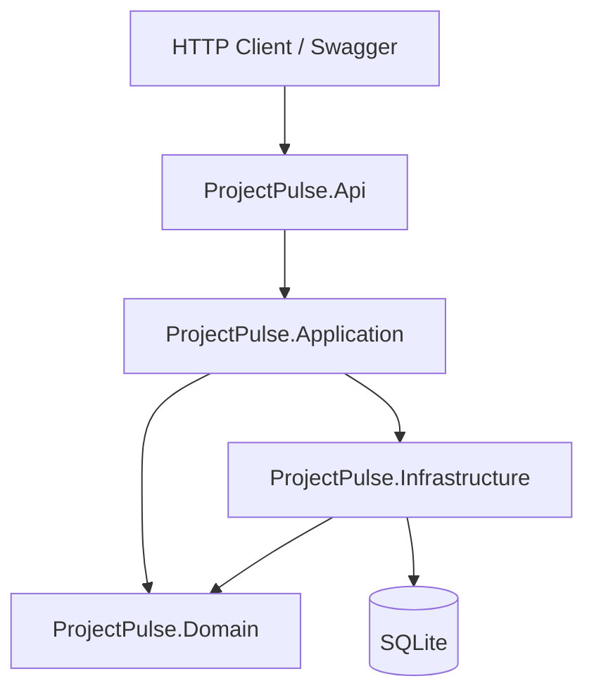

# ProjectPulse

Clean Architecture project-management system: **ASP.NET Core 8 API** + minimal **React dashboard** for demos.

The backend is the portfolio centerpiece; the frontend is a thin demo layer for recruiters and hiring managers.

## What this demonstrates

- Layered Clean Architecture (`Domain` → `Application` → `Infrastructure` → `Api`)
- CQRS-style commands and queries with validation pipeline
- Domain rules (task status workflow, project membership)
- Audit logging for task and project events
- Swagger/OpenAPI for local exploration
- Seeded demo data (3 projects, 8 users, 25 tasks)
- Unit and integration tests with CI

## Tech stack

| Layer | Technologies |
|-------|----------------|
| API | ASP.NET Core Web API, Swagger |
| Application | MediatR, FluentValidation |
| Domain | Entities, enums, domain rules |
| Infrastructure | EF Core, SQLite |
| Tests | xUnit, FluentAssertions, WebApplicationFactory |
| DevOps | Docker Compose, GitHub Actions |

## Architecture



## Run locally

### 1. API

Prerequisites: [.NET 8 SDK](https://dotnet.microsoft.com/download/dotnet/8.0)

```bash
dotnet restore
dotnet run --project src/ProjectPulse.Api
```

- Swagger: **http://localhost:5000/swagger**
- API base: **http://localhost:5000**

Or with Docker:

```bash
docker compose up --build api
```

### 2. Frontend dashboard

Prerequisites: [Node.js 20+](https://nodejs.org/)

```bash
cd frontend
npm install
npm run dev
```

- Dashboard: **http://localhost:5173**

The Vite dev server proxies `/api` to `http://localhost:5000`.

### Demo flow

1. Open the dashboard — seeded projects and stats load automatically.
2. Create a project and add a task.
3. Open a task — assign a user, change status, add a comment.
4. Check Activity for audit log updates.
5. Open Swagger to show the API contract and run `dotnet test` for CI.

## Example API requests

```bash
# List open high-priority tasks
curl "http://localhost:5000/api/tasks?status=Open&priority=High"

# Create a project
curl -X POST http://localhost:5000/api/projects \
  -H "Content-Type: application/json" \
  -d '{"name":"Sprint 42","description":"Q2 delivery"}'

# Change task status
curl -X PATCH http://localhost:5000/api/tasks/{taskId}/status \
  -H "Content-Type: application/json" \
  -d '{"status":"InProgress"}'

# Project summary
curl http://localhost:5000/api/projects/{projectId}/summary

# Activity / audit feed
curl http://localhost:5000/api/projects/{projectId}/activity
```

## Demo auth note

MVP uses a development current-user service (`jeremy.burke024@gmail.com` seeded as admin). JWT/role-based auth is planned for v2.

## Tests

```bash
dotnet test
```

## CI

GitHub Actions runs `dotnet restore`, `dotnet build`, and `dotnet test` on every push to `main`.

## Project structure

```
src/                          # .NET Clean Architecture API
  ProjectPulse.Api/
  ProjectPulse.Application/
  ProjectPulse.Domain/
  ProjectPulse.Infrastructure/
tests/
  ProjectPulse.UnitTests/
  ProjectPulse.IntegrationTests/
frontend/                     # React + Vite + Tailwind dashboard
```

