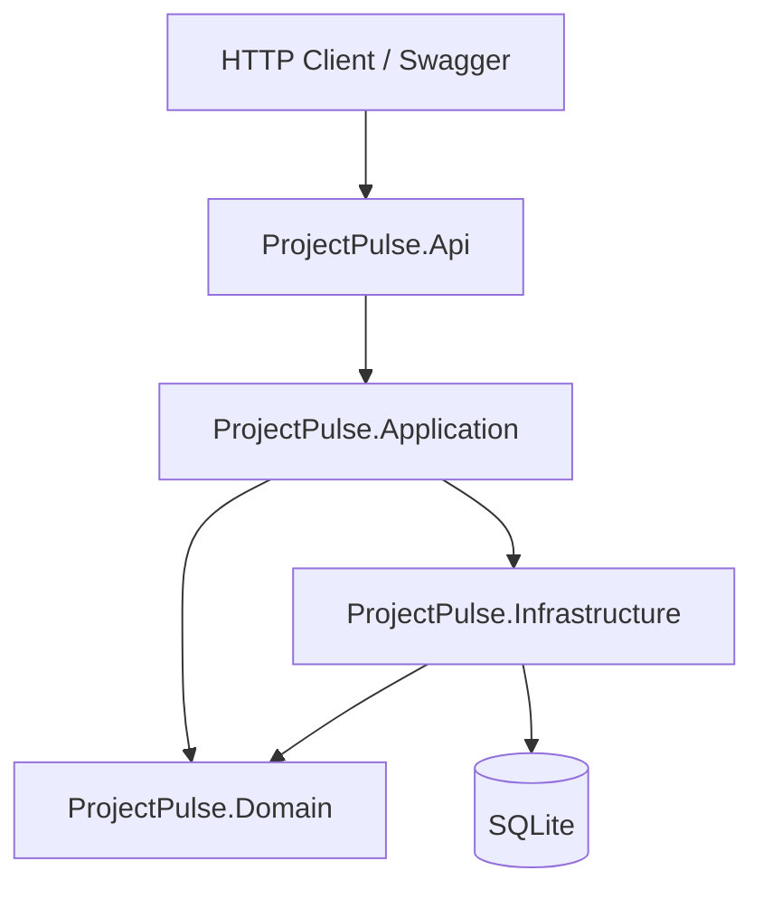

# ProjectPulse API

Clean Architecture project-management backend built with **ASP.NET Core 8**, **EF Core**, **CQRS (MediatR)**, **FluentValidation**, **xUnit**, **Docker Compose**, and **GitHub Actions**.

## What this demonstrates

- Layered Clean Architecture (`Domain` → `Application` → `Infrastructure` → `Api`)
- CQRS-style commands and queries with validation pipeline
- Domain rules (task status workflow, project membership)
- Audit logging for task and project events
- Swagger/OpenAPI for local exploration
- Seeded demo data (3 projects, 8 users, 25 tasks)
- Unit and integration tests with CI

## Tech stack

| Layer | Technologies |
|-------|----------------|
| API | ASP.NET Core Web API, Swagger |
| Application | MediatR, FluentValidation |
| Domain | Entities, enums, domain rules |
| Infrastructure | EF Core, SQLite |
| Tests | xUnit, FluentAssertions, WebApplicationFactory |
| DevOps | Docker Compose, GitHub Actions |

## Architecture



## Run locally (one command)

### Docker Compose

```bash
docker compose up --build
```

Open **http://localhost:5000/swagger**

### .NET CLI

Prerequisites: [.NET 8 SDK](https://dotnet.microsoft.com/download/dotnet/8.0)

```bash
dotnet restore
dotnet run --project src/ProjectPulse.Api
```

Swagger: **http://localhost:5000/swagger**

## Example API requests

```bash
# List open high-priority tasks
curl "http://localhost:5000/api/tasks?status=Open&priority=High"

# Create a project
curl -X POST http://localhost:5000/api/projects \
  -H "Content-Type: application/json" \
  -d '{"name":"Sprint 42","description":"Q2 delivery"}'

# Change task status
curl -X PATCH http://localhost:5000/api/tasks/{taskId}/status \
  -H "Content-Type: application/json" \
  -d '{"status":"InProgress"}'

# Project summary
curl http://localhost:5000/api/projects/{projectId}/summary

# Activity / audit feed
curl http://localhost:5000/api/projects/{projectId}/activity
```

## Demo auth note

MVP uses a development current-user service (`jeremy.burke024@gmail.com` seeded as admin). JWT/role-based auth is planned for v2.

## Tests

```bash
dotnet test
```

## CI

GitHub Actions runs `dotnet restore`, `dotnet build`, and `dotnet test` on every push to `main`.

## Project structure

```
src/
  ProjectPulse.Api/
  ProjectPulse.Application/
  ProjectPulse.Domain/
  ProjectPulse.Infrastructure/
tests/
  ProjectPulse.UnitTests/
  ProjectPulse.IntegrationTests/
```

