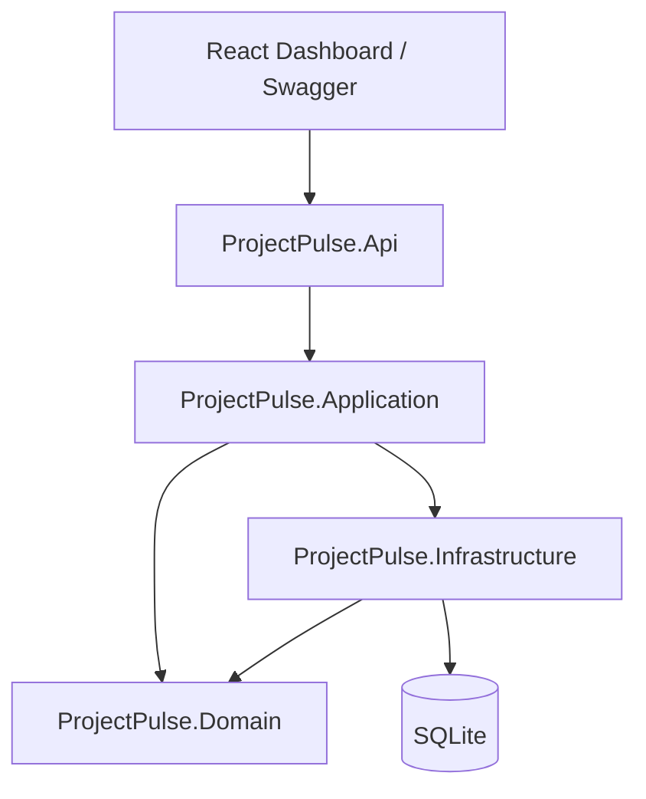
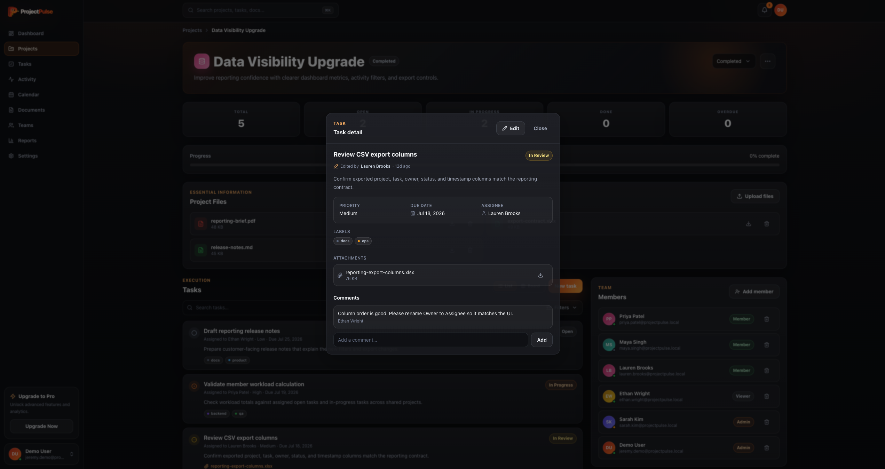
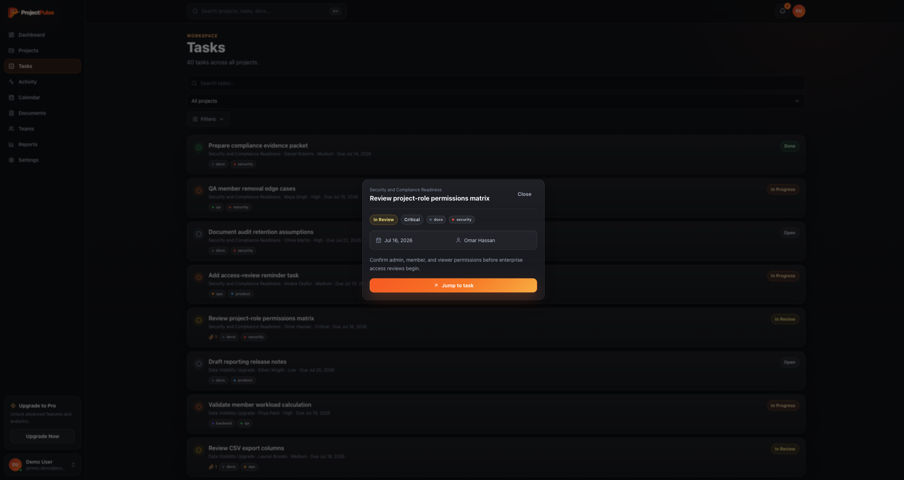
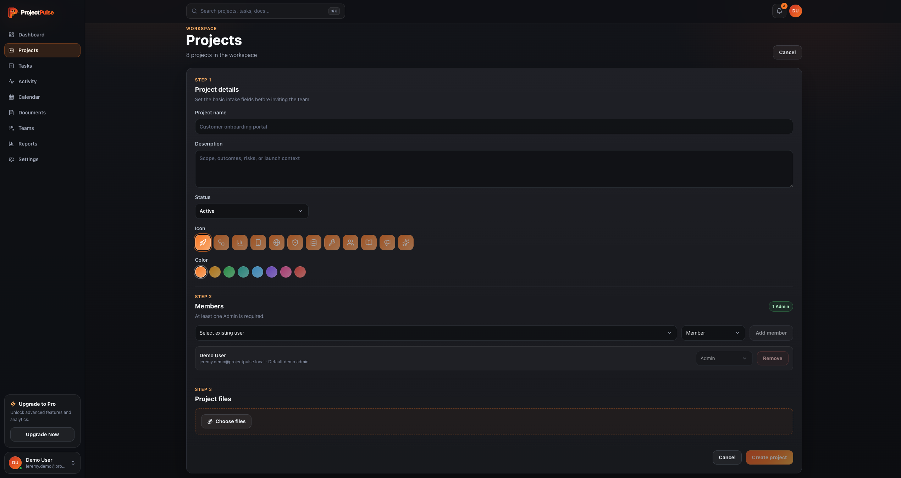

# ProjectPulse

ProjectPulse is a production-style project-management portfolio app built with an **ASP.NET Core 8 Clean Architecture API** and a **React/Vite/Tailwind dashboard**. It demonstrates realistic project and task workflows with project membership, role-based permissions, task assignment, status transitions, comments, audit history, Swagger/OpenAPI documentation, demo-session isolation, and automated tests.

The backend is the core of the project. The frontend is a full workspace dashboard around it: a sidebar app shell with nine sections (Dashboard, Projects, Tasks, Activity, Calendar, Documents, Teams, Reports, Settings), a Cmd+K command palette, notification previews, an editable demo profile, and customizable project icons and colors.

## Live Demo

* **Frontend Demo:** https://projectpulse-demo.vercel.app
* **API Docs:** https://projectpulse-api-00h9.onrender.com/swagger

> Demo sessions are temporary and may reset when the hosted free backend restarts. Start a new demo session to reload the seeded workspace.

## What This Demonstrates

* Clean Architecture boundaries: `Domain`, `Application`, `Infrastructure`, and `Api`
* CQRS-style commands and queries with MediatR
* FluentValidation request validation and centralized exception handling
* EF Core persistence with SQLite and migrations
* Public demo-session flow with isolated seeded workspaces and background cleanup of expired sessions
* Realistic seeded project, task, member, label, comment, and audit data
* Project lifecycle statuses (`Planning`, `Active`, `OnHold`, `Completed`) with create/update endpoints
* Task creation workflow with description, priority, status, due date, assignee, file attachments, and context notes
* Real file uploads on both tasks and projects with size limits, extension allowlists, safe server-generated storage keys, and download/delete endpoints
* Seeded demo attachments generate representative file content on download
* Color-coded project labels with attach/detach endpoints and task filtering
* Kanban board with drag-and-drop status changes enforced by domain transition rules
* Domain rules for task status transitions and project membership permissions
* Role-aware project membership with `Admin`, `Member`, and `Viewer` roles
* Viewer users excluded from task assignment
* Last-admin protection when removing project members
* Automatic task unassignment when a removed member had assigned tasks
* Audit logging for projects, tasks, comments, assignments, status changes, attachments, and membership changes
* Paginated list endpoints with enforced page-size limits
* Rate limiting (global per-session budget plus a stricter demo-session-creation policy)
* Structured logging with Serilog request logging
* Swagger/OpenAPI for direct API exploration
* Dashboard aggregates: task/project status breakdowns, team counts, and a pure-SVG donut chart
* Customizable project appearance (icon + color) persisted through create and edit endpoints
* Editable demo profile (display name + avatar color) via `PUT /api/users/me`
* React dashboard with optimistic updates, toasts, skeleton loading, and confirm dialogs
* Sidebar app shell with global Tasks, Calendar, Documents, Teams, Reports, and Settings pages
* Working Cmd+K command palette across navigation, projects, and tasks
* Preview-then-jump dialogs for notifications, activity, calendar chips, and task rows
* CSS motion system (dialog/menu/page transitions) honoring `prefers-reduced-motion`
* Unit, integration, and frontend component tests wired into CI

## Tech Stack

| Layer          | Technologies                                                            |
| -------------- | ----------------------------------------------------------------------- |
| API            | ASP.NET Core 8 Web API, Swagger/OpenAPI, rate limiting, Serilog         |
| Application    | MediatR, FluentValidation                                               |
| Domain         | Entities, enums, domain rules                                           |
| Infrastructure | EF Core, SQLite, local file storage, background services                |
| Frontend       | React, TypeScript, Vite, Tailwind CSS, TanStack Query, dnd-kit, sonner  |
| Tests          | xUnit, FluentAssertions, WebApplicationFactory, Vitest, Testing Library |
| DevOps         | Docker Compose, GitHub Actions, Vercel, Render                          |

## Architecture



## Demo Screenshots

### Dashboard

The dashboard greets the demo user with workspace stats, a project-status donut with overall progress, recent activity, a tabbed My Tasks table, top team members with presence, and upcoming deadlines. The top bar has global search (Cmd+K) and a notification bell filtered to events involving the demo user.


### Task Detail

Tasks open in a centered modal with a locked read view: status, priority, due date, assignee, labels, attachments, comments, and "Edited by" attribution. An Edit toggle reveals the full editing form, and activity links can deep-link into a specific comment.



### Global Tasks With Preview-Then-Jump

The Tasks page lists every task across projects with search, a project scope, and a combined Filters menu (status, priority, assignee, label). Clicking a task shows a preview dialog first, with an explicit "Jump to task" action - the same pattern used by notifications, activity, and calendar entries.



### Project Creation With Icon And Color

New projects capture details, members with roles, and starter files, plus a persisted appearance: a 12-icon picker and 8 color swatches that brand the project's tile across the app. Projects can be renamed and restyled later from an Edit project dialog.



### Swagger/OpenAPI

Swagger exposes the raw API contract for dashboard, demo sessions, projects, tasks, users, activity, project members, comments, and status/assignment endpoints.


## Core Workflows

* Start a public demo session with seeded project/task/member data.
* View dashboard metrics for projects, open tasks, completed tasks, overdue tasks, team members, and recent activity.
* Browse realistic seeded projects with lifecycle status badges and themed icon tiles.
* Create projects with name, description, status, icon/color appearance, member selection, and role assignment.
* Edit a project's name, description, icon, and color from the project actions menu.
* Add members to a project as `Admin`, `Member`, or `Viewer`.
* Remove project members while protecting the final admin.
* Create tasks with title, detailed description, priority, status, due date, eligible assignee, file attachments, and optional context.
* Assign tasks only to eligible project members. `Viewer` users cannot be assigned tasks.
* Edit task title, description, priority, due date, and assignee.
* Move tasks through allowed status transitions from the task panel or by dragging cards on the Kanban board.
* Attach and detach color-coded labels on tasks.
* Upload, download, and delete task file attachments (5 MB limit, extension allowlist).
* Keep essential project files in a dedicated section at the top of each project.
* Attach labels and files while creating a task, and see file names on task cards.
* Filter and search tasks by status, priority, assignee, label, and text - per project or across the whole workspace.
* Add comments to tasks.
* Jump anywhere with the Cmd+K command palette (navigation, projects, tasks).
* Preview notifications, activity, calendar chips, and task rows in a dialog before jumping to them.
* Browse tasks by due date on a month calendar and all workspace files on the Documents page.
* Review client-computed reports: task status donut, per-project progress, priority breakdown, and overdue table.
* Edit the demo profile's display name and avatar color from the account menu.
* Review audit history across project and workspace activity feeds.
* Click activity records to inspect detailed event context.
* Inspect and test endpoints directly through Swagger.

## Run Locally

### 1. API

Prerequisite: [.NET 8 SDK](https://dotnet.microsoft.com/download/dotnet/8.0)

From the repository root:

```bash
dotnet restore
dotnet run --project src/ProjectPulse.Api
```

* Swagger: **http://localhost:5000/swagger**
* API base: **http://localhost:5000**

Or with Docker:

```bash
docker compose up --build api
```

### 2. Frontend Dashboard

Prerequisite: [Node.js 20+](https://nodejs.org/)

The frontend `package.json` is inside `frontend/`, so run npm commands from that directory:

```bash
cd frontend
npm install
npm run dev
```

* Dashboard: **http://localhost:5173**

The Vite dev server proxies `/api` to `http://localhost:5000`.

## Demo Flow

1. Start the API and frontend.
2. Click **Start New Demo Session** to create an isolated seeded workspace for this browser.
3. Review the dashboard: stat cards, project-status donut, recent activity, My Tasks tabs, team presence, and upcoming deadlines.
4. Open the Projects page and browse seeded projects with their themed icon tiles.
5. Create a project with a name, description, status, icon, color, and member roles.
6. Open a project detail page and review tasks, members, progress, files, and recent activity.
7. Add project members as `Admin`, `Member`, or `Viewer`.
8. Create a task with a detailed description, priority, status, due date, eligible assignee, file attachments, and context notes.
9. Switch to the Board view and drag tasks between status columns.
10. Open a task to change status, priority, due date, assignee, labels, attachments, and comments.
11. Press Cmd+K (or Ctrl+K) and jump to any page, project, or task from the command palette.
12. Check the notification bell and click an entry to preview it before jumping to the task.
13. Explore the global Tasks, Calendar, Documents, Teams, and Reports pages.
14. Open the account menu to edit the demo profile's display name and avatar color.
15. Remove a project member and confirm their assigned project tasks become unassigned.
16. Open Activity to review audit entries for tasks, assignments, comments, attachments, and membership changes.
17. Open Swagger to inspect and test the raw API endpoints.
18. Use **Clear and start new session** to create a fresh seeded workspace.

## API Highlights

```bash
# List projects (paginated)
curl "http://localhost:5000/api/projects?page=1&pageSize=20"

# Create a project with a lifecycle status and appearance
curl -X POST http://localhost:5000/api/projects \
  -H "Content-Type: application/json" \
  -d '{"name":"Sprint 42","description":"Q2 delivery","status":"Planning","icon":"rocket","color":"#ff7b22"}'

# Update a project (name, description, status, optional icon/color)
curl -X PUT http://localhost:5000/api/projects/{projectId} \
  -H "Content-Type: application/json" \
  -d '{"name":"Sprint 42","description":"Q2 delivery","status":"Active","icon":"shield","color":"#ef4444"}'

# Update the session user's profile (display name, avatar color)
curl -X PUT http://localhost:5000/api/users/me \
  -H "Content-Type: application/json" \
  -d '{"displayName":"Jamie Demo","avatarColor":"#14b8a6"}'

# Add a project member
curl -X POST http://localhost:5000/api/projects/{projectId}/members \
  -H "Content-Type: application/json" \
  -d '{"userId":"{userId}","role":"Member"}'

# Create an assigned task
curl -X POST http://localhost:5000/api/tasks \
  -H "Content-Type: application/json" \
  -d '{"projectId":"{projectId}","title":"Build task workflow","description":"Implement the project task workflow and validation rules.","priority":"High","status":"Open","assigneeId":"{userId}","dueDateUtc":null}'

# Change task status
curl -X PATCH http://localhost:5000/api/tasks/{taskId}/status \
  -H "Content-Type: application/json" \
  -d '{"status":"InProgress"}'

# Assign or unassign a task
curl -X PATCH http://localhost:5000/api/tasks/{taskId}/assign \
  -H "Content-Type: application/json" \
  -d '{"assigneeId":"{userId}"}'

# Add a comment to a task
curl -X POST http://localhost:5000/api/tasks/{taskId}/comments \
  -H "Content-Type: application/json" \
  -d '{"body":"Confirmed the workflow edge case and added a test note."}'

# List a project's labels, then attach one to a task
curl http://localhost:5000/api/projects/{projectId}/labels
curl -X POST http://localhost:5000/api/tasks/{taskId}/labels \
  -H "Content-Type: application/json" \
  -d '{"labelId":"{labelId}"}'

# Upload, download, and delete a task attachment
curl -X POST http://localhost:5000/api/tasks/{taskId}/attachments \
  -F "file=@notes.pdf"
curl -OJ http://localhost:5000/api/tasks/{taskId}/attachments/{attachmentId}/download
curl -X DELETE http://localhost:5000/api/tasks/{taskId}/attachments/{attachmentId}

# Remove a project member
curl -X DELETE http://localhost:5000/api/projects/{projectId}/members/{userId}

# Project summary and activity
curl http://localhost:5000/api/projects/{projectId}/summary
curl http://localhost:5000/api/projects/{projectId}/activity

# Workspace activity (paginated, max page size 200)
curl "http://localhost:5000/api/activity?page=1&pageSize=50"
```

## Authorization Note

This demo uses a lightweight portfolio-demo session instead of full user accounts. The frontend stores a generated demo session ID in browser local storage and sends it as `X-ProjectPulse-Demo-Session`; the API scopes projects, tasks, users, and activity to that session's seeded workspace.

Without the header, Swagger/local API calls still use the seeded admin user. Project membership rules are enforced in the application layer: only admins can manage project members, only admins can delete projects, only admins or members can manage tasks, and viewers cannot be assigned tasks. JWT authentication and production-ready role-based authorization are planned for a future version.

## Hosted Demo Deployment

Current hosted demo:

* Frontend: Vercel
* API: Render
* Database: SQLite-backed demo storage

Recommended production-oriented upgrade path:

* Move demo persistence to hosted Postgres, or
* Use a paid Render instance with a persistent disk mounted for SQLite

Backend environment variables:

```bash
ConnectionStrings__DefaultConnection=Data Source=/data/projectpulse.db
Cors__AllowedOrigins__0=https://your-projectpulse-demo.vercel.app
```

Frontend environment variables:

```bash
VITE_API_BASE_URL=https://your-projectpulse-api.onrender.com
VITE_API_DOCS_URL=https://your-projectpulse-api.onrender.com/swagger
```

## Tests

```bash
dotnet test
```

Frontend checks:

```bash
cd frontend
npm run lint
npm test
npm run build
```

The backend suite includes unit tests for domain rules, validators, and pagination plus integration tests for API workflows: project CRUD, statuses, and appearance persistence, labels, attachment upload/download round-trips, dashboard and user aggregates, profile updates, pagination clamps, rate limiting, demo-session isolation, task updates, status changes, and member add/remove behavior. The frontend suite covers shared helpers (status transitions, greetings, presence, calendar math, dates, avatars, project icons) and component rendering (donut chart, filter menu, command palette, profile dialog) with Vitest and Testing Library.

## CI

GitHub Actions runs two jobs on every push and pull request to `main`: backend restore/build/test, and frontend lint/test/build.

## Project Structure

```txt
src/
  ProjectPulse.Api/
  ProjectPulse.Application/
  ProjectPulse.Domain/
  ProjectPulse.Infrastructure/

tests/
  ProjectPulse.UnitTests/
  ProjectPulse.IntegrationTests/

frontend/
  React + Vite + Tailwind dashboard

```

## Planned Improvements

* JWT authentication and production-ready authorization
* Persistent hosted database for longer-lived public demo sessions
* Role editing for existing project members
* Cloud blob storage (S3/Azure) for attachments in hosted environments
* User account registration and workspace invite flow
