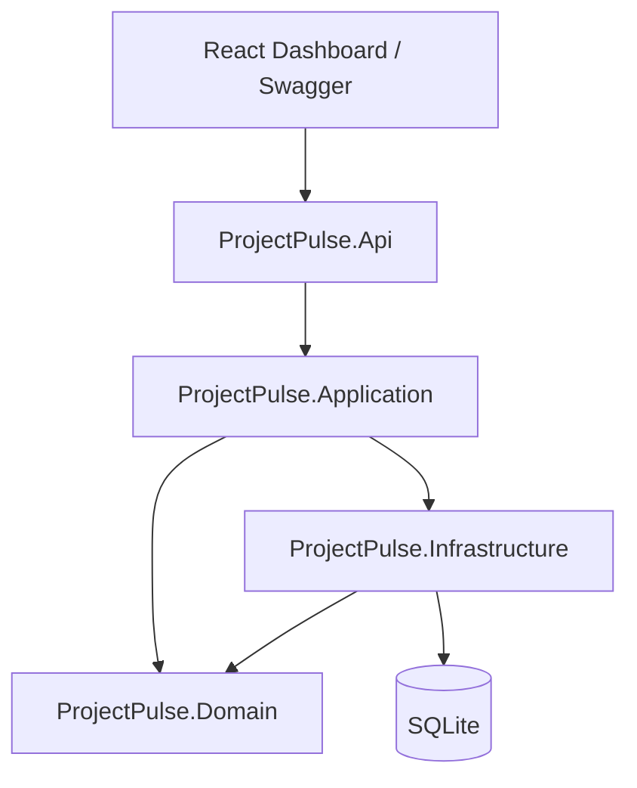
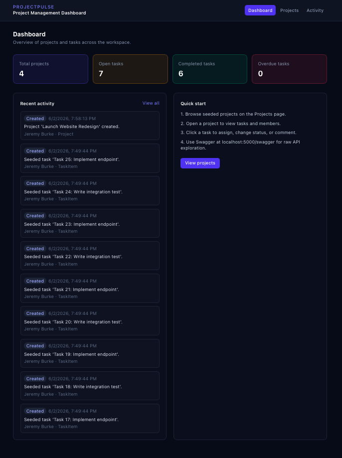
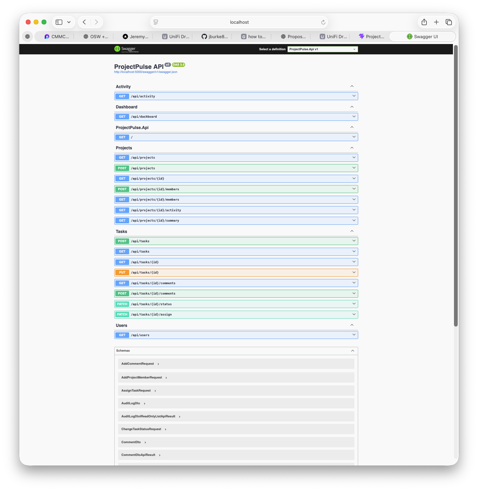
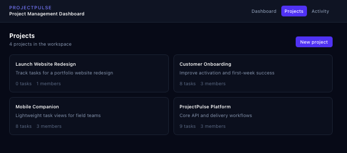
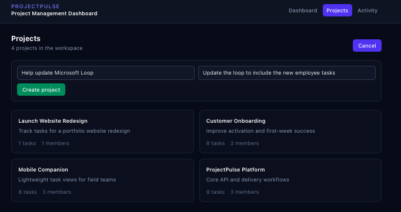

# ProjectPulse

Clean Architecture project-management system: **ASP.NET Core 8 API** + minimal **React dashboard** for demos.

The backend is the portfolio centerpiece; the frontend is a thin demo layer that makes the API workflow easy to understand for recruiters, hiring managers, and technical reviewers.

## What this demonstrates

* Layered Clean Architecture (`Domain` → `Application` → `Infrastructure` → `Api`)
* CQRS-style commands and queries with validation pipeline
* Domain rules for task status workflow and project membership
* Audit logging for task and project events
* Swagger/OpenAPI for local API exploration
* React/Vite dashboard consuming the ASP.NET Core API
* Seeded demo data with projects, users, tasks, and activity
* Unit and integration tests with CI

## Tech stack

| Layer          | Technologies                                   |
| -------------- | ---------------------------------------------- |
| API            | ASP.NET Core 8 Web API, Swagger/OpenAPI        |
| Application    | MediatR, FluentValidation                      |
| Domain         | Entities, enums, domain rules                  |
| Infrastructure | EF Core, SQLite                                |
| Frontend       | React, TypeScript, Vite, Tailwind CSS          |
| Tests          | xUnit, FluentAssertions, WebApplicationFactory |
| DevOps         | Docker Compose, GitHub Actions                 |

## Architecture



## Demo screenshots

### Dashboard overview

The dashboard shows project/task metrics, seeded workspace activity, and a quick-start flow for local demo use.



### Swagger/OpenAPI documentation

Swagger exposes the backend API contract for Projects, Tasks, Activity, Dashboard, and Users endpoints.



### Projects page

The Projects page loads seeded and user-created projects from the ASP.NET Core API.



### Create project workflow

The frontend provides a simple project creation flow that persists new records through the API.



### Project detail and task workflow

The project detail view supports task creation, task editing, status updates, priority changes, assignment, comments, project members, and recent activity.


### Activity log

The activity log shows audit-style events for project creation, task creation, assignment, updates, and comments.


## Run locally

### 1. API

Prerequisite: [.NET 8 SDK](https://dotnet.microsoft.com/download/dotnet/8.0)

```bash
dotnet restore
dotnet run --project src/ProjectPulse.Api
```

* Swagger: **http://localhost:5000/swagger**
* API base: **http://localhost:5000**

Or with Docker:

```bash
docker compose up --build api
```

### 2. Frontend dashboard

Prerequisite: [Node.js 20+](https://nodejs.org/)

```bash
cd frontend
npm install
npm run dev
```

* Dashboard: **http://localhost:5173**

The Vite dev server proxies `/api` to `http://localhost:5000`.

## Demo flow

1. Open the dashboard and review seeded project/task metrics.
2. Open the Projects page and create a new project.
3. Open a project detail page and add a task.
4. Open a task and update status, priority, assignee, and comments.
5. Check the Activity page to see audit log updates.
6. Open Swagger to inspect and test the raw API endpoints.
7. Run `dotnet test` to verify the backend test suite.

## Example API requests

```bash
# List open high-priority tasks
curl "http://localhost:5000/api/tasks?status=Open&priority=High"

# Create a project
curl -X POST http://localhost:5000/api/projects \
  -H "Content-Type: application/json" \
  -d '{"name":"Sprint 42","description":"Q2 delivery"}'

# Change task status
curl -X PATCH http://localhost:5000/api/tasks/{taskId}/status \
  -H "Content-Type: application/json" \
  -d '{"status":"InProgress"}'

# Project summary
curl http://localhost:5000/api/projects/{projectId}/summary

# Activity / audit feed
curl http://localhost:5000/api/projects/{projectId}/activity
```

## Demo auth note

The MVP uses a development current-user service with a seeded admin user for local demo workflows. JWT and role-based authentication are planned for a future version.

## Tests

```bash
dotnet test
```

## CI

GitHub Actions runs restore, build, and test checks on every push to `main`.

## Project structure

```txt
src/
  ProjectPulse.Api/
  ProjectPulse.Application/
  ProjectPulse.Domain/
  ProjectPulse.Infrastructure/

tests/
  ProjectPulse.UnitTests/
  ProjectPulse.IntegrationTests/

frontend/
  React + Vite + Tailwind dashboard

readme_images/
  Demo screenshots used in this README
```

## Planned improvements

* JWT authentication and role-based authorization
* More detailed dashboard charts
* Kanban-style task board
* Additional integration tests
* Optional hosted demo deployment
