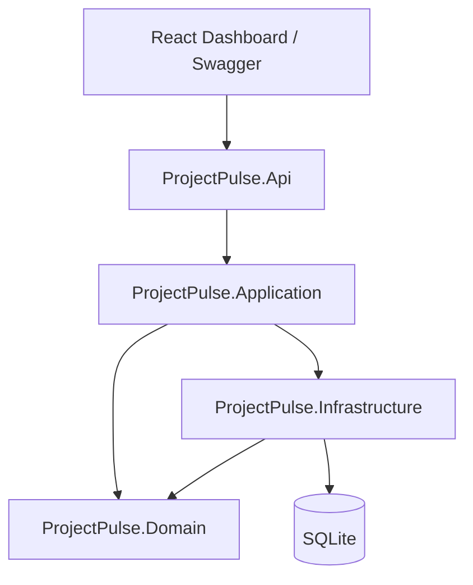
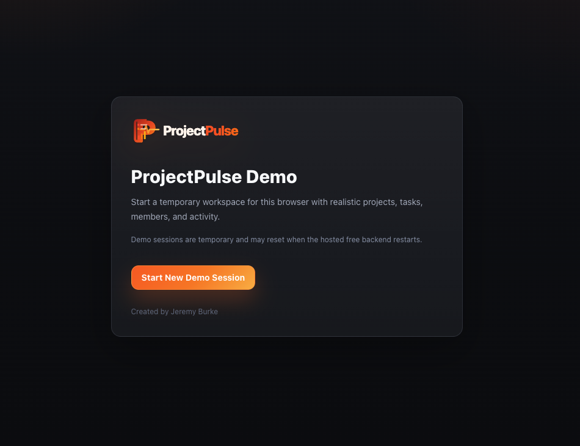
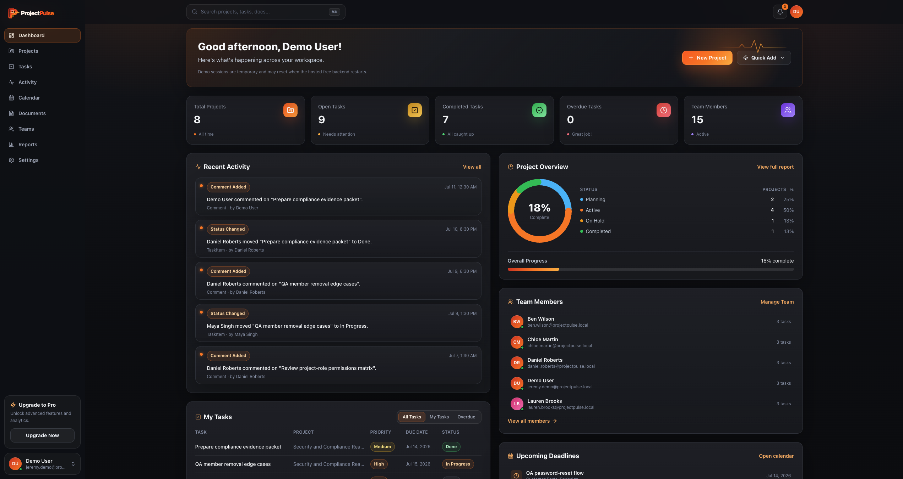
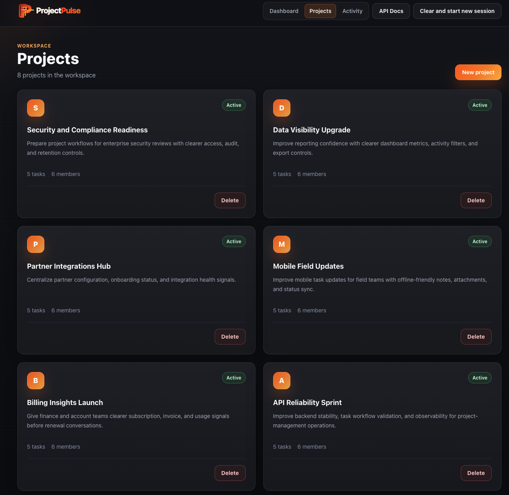
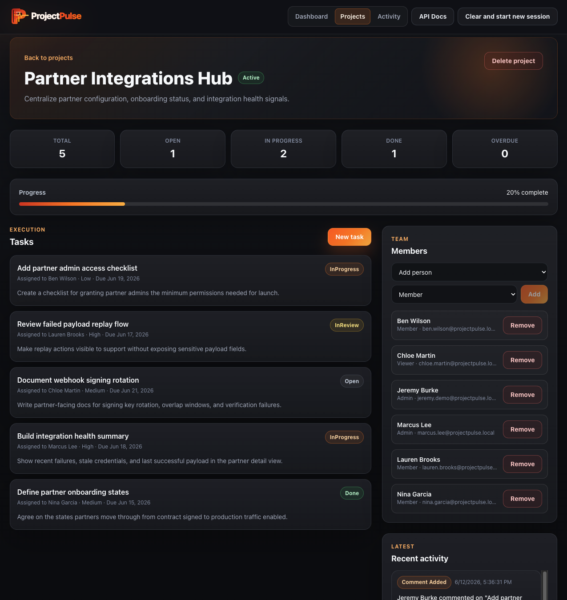
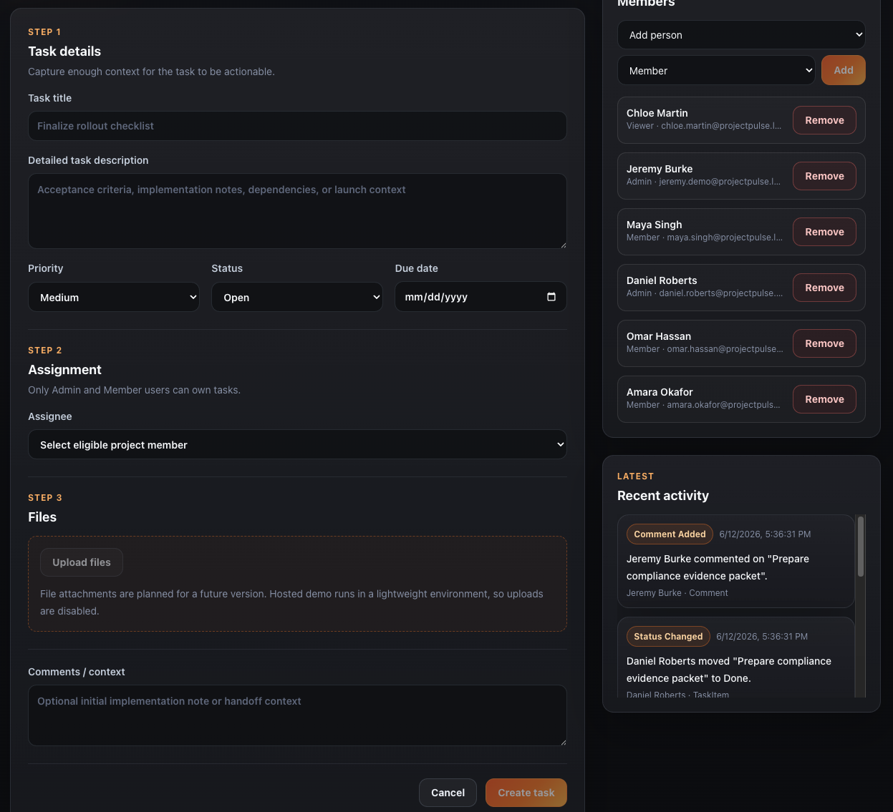
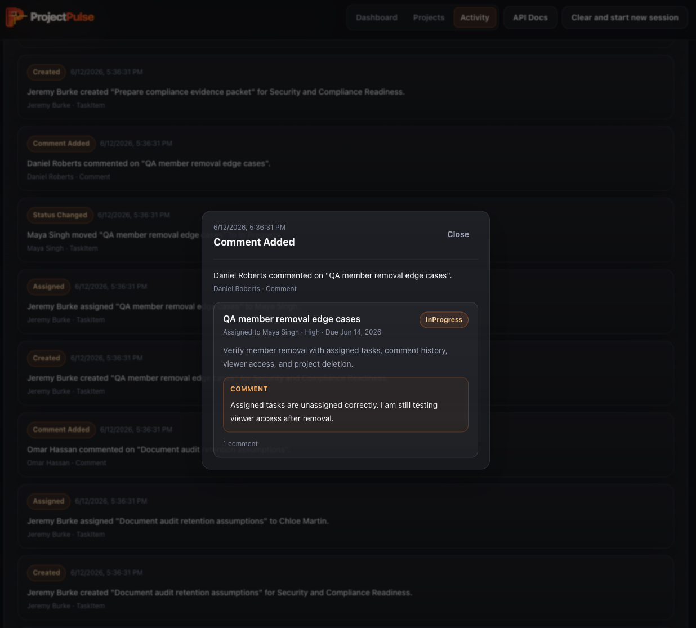
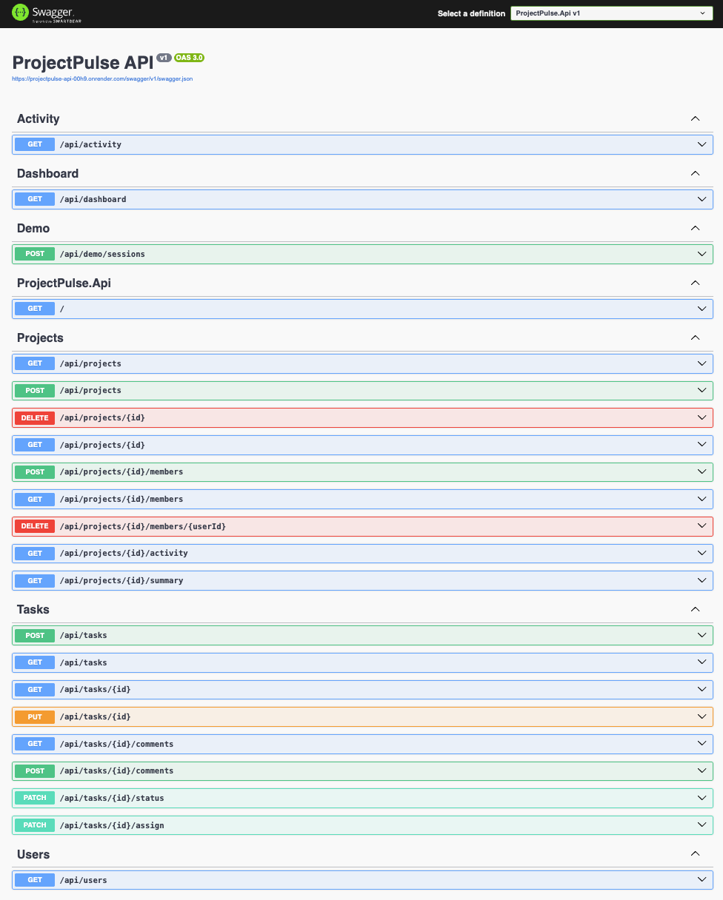

# ProjectPulse

ProjectPulse is a production-style project-management portfolio app built with an **ASP.NET Core 8 Clean Architecture API** and a **React/Vite/Tailwind dashboard**. It demonstrates realistic project and task workflows with project membership, role-based permissions, task assignment, status transitions, comments, audit history, Swagger/OpenAPI documentation, demo-session isolation, and automated tests.

The backend is the core of the project. The frontend is a polished demo client that makes the API workflow easy to review through a public portfolio-ready interface.

## Live Demo

* **Frontend Demo:** https://projectpulse-demo.vercel.app
* **API Docs:** https://projectpulse-api-00h9.onrender.com/swagger

> Demo sessions are temporary and may reset when the hosted free backend restarts. Start a new demo session to reload the seeded workspace.

## What This Demonstrates

* Clean Architecture boundaries: `Domain`, `Application`, `Infrastructure`, and `Api`
* CQRS-style commands and queries with MediatR
* FluentValidation request validation and centralized exception handling
* EF Core persistence with SQLite and migrations
* Public demo-session flow with isolated seeded workspaces and background cleanup of expired sessions
* Realistic seeded project, task, member, label, comment, and audit data
* Project lifecycle statuses (`Planning`, `Active`, `OnHold`, `Completed`) with create/update endpoints
* Task creation workflow with description, priority, status, due date, assignee, file attachments, and context notes
* Real file uploads with size limits, extension allowlists, safe server-generated storage keys, and download/delete endpoints
* Color-coded project labels with attach/detach endpoints and task filtering
* Kanban board with drag-and-drop status changes enforced by domain transition rules
* Domain rules for task status transitions and project membership permissions
* Role-aware project membership with `Admin`, `Member`, and `Viewer` roles
* Viewer users excluded from task assignment
* Last-admin protection when removing project members
* Automatic task unassignment when a removed member had assigned tasks
* Audit logging for projects, tasks, comments, assignments, status changes, attachments, and membership changes
* Paginated list endpoints with enforced page-size limits
* Rate limiting (global per-session budget plus a stricter demo-session-creation policy)
* Structured logging with Serilog request logging
* Swagger/OpenAPI for direct API exploration
* React dashboard with optimistic updates, toasts, skeleton loading, and confirm dialogs
* Unit, integration, and frontend component tests wired into CI

## Tech Stack

| Layer          | Technologies                                                            |
| -------------- | ----------------------------------------------------------------------- |
| API            | ASP.NET Core 8 Web API, Swagger/OpenAPI, rate limiting, Serilog         |
| Application    | MediatR, FluentValidation                                               |
| Domain         | Entities, enums, domain rules                                           |
| Infrastructure | EF Core, SQLite, local file storage, background services                |
| Frontend       | React, TypeScript, Vite, Tailwind CSS, TanStack Query, dnd-kit, sonner  |
| Tests          | xUnit, FluentAssertions, WebApplicationFactory, Vitest, Testing Library |
| DevOps         | Docker Compose, GitHub Actions, Vercel, Render                          |

## Architecture



## Demo Screenshots

### Demo Session Start

ProjectPulse uses a lightweight public demo-session flow instead of full user accounts. Visitors can start a temporary workspace with realistic seeded projects, tasks, members, and activity.



### Dashboard

The dashboard summarizes the seeded workspace with project/task metrics, recent activity, and a quick-start guide for exploring the demo.



### Projects Workspace

The Projects page presents realistic project cards with descriptions, task counts, member counts, and workspace-level actions.



### Project Detail, Tasks, Members, And Activity

Project detail pages show project metrics, progress, task cards, task creation, member management, role labels, and recent project activity in one workspace view.



### Task Creation Flow

The task creation flow captures enough information for a realistic task: title, detailed description, priority, status, due date, eligible assignee, file-upload placeholder, and optional context notes.



### Activity Details

The Activity page provides an audit-style history of workspace events. Activity cards are clickable and open a detail view with actor, timestamp, action type, related task/project context, and comments when available.



### Swagger/OpenAPI

Swagger exposes the raw API contract for dashboard, demo sessions, projects, tasks, users, activity, project members, comments, and status/assignment endpoints.



## Core Workflows

* Start a public demo session with seeded project/task/member data.
* View dashboard metrics for projects, open tasks, completed tasks, overdue tasks, and recent activity.
* Browse realistic seeded projects with lifecycle status badges.
* Create projects with name, description, status, member selection, and role assignment.
* Add members to a project as `Admin`, `Member`, or `Viewer`.
* Remove project members while protecting the final admin.
* Create tasks with title, detailed description, priority, status, due date, eligible assignee, file attachments, and optional context.
* Assign tasks only to eligible project members. `Viewer` users cannot be assigned tasks.
* Edit task title, description, priority, due date, and assignee.
* Move tasks through allowed status transitions from the task panel or by dragging cards on the Kanban board.
* Attach and detach color-coded labels on tasks.
* Upload, download, and delete task file attachments (5 MB limit, extension allowlist).
* Filter and search tasks by status, priority, assignee, and text.
* Add comments to tasks.
* Review audit history across project and workspace activity feeds.
* Click activity records to inspect detailed event context.
* Inspect and test endpoints directly through Swagger.

## Run Locally

### 1. API

Prerequisite: [.NET 8 SDK](https://dotnet.microsoft.com/download/dotnet/8.0)

From the repository root:

```bash
dotnet restore
dotnet run --project src/ProjectPulse.Api
```

* Swagger: **http://localhost:5000/swagger**
* API base: **http://localhost:5000**

Or with Docker:

```bash
docker compose up --build api
```

### 2. Frontend Dashboard

Prerequisite: [Node.js 20+](https://nodejs.org/)

The frontend `package.json` is inside `frontend/`, so run npm commands from that directory:

```bash
cd frontend
npm install
npm run dev
```

* Dashboard: **http://localhost:5173**

The Vite dev server proxies `/api` to `http://localhost:5000`.

## Demo Flow

1. Start the API and frontend.
2. Click **Start New Demo Session** to create an isolated seeded workspace for this browser.
3. Review dashboard metrics and recent activity.
4. Open the Projects page and browse seeded projects.
5. Create a project with a name, description, status, and member roles.
6. Open a project detail page and review tasks, members, progress, and recent activity.
7. Add project members as `Admin`, `Member`, or `Viewer`.
8. Create a task with a detailed description, priority, status, due date, eligible assignee, file attachments, and context notes.
9. Switch to the Board view and drag tasks between status columns.
10. Open a task to change status, priority, due date, assignee, labels, attachments, and comments.
11. Remove a project member and confirm their assigned project tasks become unassigned.
12. Open Activity to review audit entries for tasks, assignments, comments, attachments, and membership changes.
13. Click an activity record to inspect detailed event context.
14. Open Swagger to inspect and test the raw API endpoints.
15. Use **Clear and start new session** to create a fresh seeded workspace.

## API Highlights

```bash
# List projects (paginated)
curl "http://localhost:5000/api/projects?page=1&pageSize=20"

# Create a project with a lifecycle status
curl -X POST http://localhost:5000/api/projects \
  -H "Content-Type: application/json" \
  -d '{"name":"Sprint 42","description":"Q2 delivery","status":"Planning"}'

# Update a project (name, description, status)
curl -X PUT http://localhost:5000/api/projects/{projectId} \
  -H "Content-Type: application/json" \
  -d '{"name":"Sprint 42","description":"Q2 delivery","status":"Active"}'

# Add a project member
curl -X POST http://localhost:5000/api/projects/{projectId}/members \
  -H "Content-Type: application/json" \
  -d '{"userId":"{userId}","role":"Member"}'

# Create an assigned task
curl -X POST http://localhost:5000/api/tasks \
  -H "Content-Type: application/json" \
  -d '{"projectId":"{projectId}","title":"Build task workflow","description":"Implement the project task workflow and validation rules.","priority":"High","status":"Open","assigneeId":"{userId}","dueDateUtc":null}'

# Change task status
curl -X PATCH http://localhost:5000/api/tasks/{taskId}/status \
  -H "Content-Type: application/json" \
  -d '{"status":"InProgress"}'

# Assign or unassign a task
curl -X PATCH http://localhost:5000/api/tasks/{taskId}/assign \
  -H "Content-Type: application/json" \
  -d '{"assigneeId":"{userId}"}'

# Add a comment to a task
curl -X POST http://localhost:5000/api/tasks/{taskId}/comments \
  -H "Content-Type: application/json" \
  -d '{"body":"Confirmed the workflow edge case and added a test note."}'

# List a project's labels, then attach one to a task
curl http://localhost:5000/api/projects/{projectId}/labels
curl -X POST http://localhost:5000/api/tasks/{taskId}/labels \
  -H "Content-Type: application/json" \
  -d '{"labelId":"{labelId}"}'

# Upload, download, and delete a task attachment
curl -X POST http://localhost:5000/api/tasks/{taskId}/attachments \
  -F "file=@notes.pdf"
curl -OJ http://localhost:5000/api/tasks/{taskId}/attachments/{attachmentId}/download
curl -X DELETE http://localhost:5000/api/tasks/{taskId}/attachments/{attachmentId}

# Remove a project member
curl -X DELETE http://localhost:5000/api/projects/{projectId}/members/{userId}

# Project summary and activity
curl http://localhost:5000/api/projects/{projectId}/summary
curl http://localhost:5000/api/projects/{projectId}/activity

# Workspace activity (paginated, max page size 200)
curl "http://localhost:5000/api/activity?page=1&pageSize=50"
```

## Authorization Note

This demo uses a lightweight portfolio-demo session instead of full user accounts. The frontend stores a generated demo session ID in browser local storage and sends it as `X-ProjectPulse-Demo-Session`; the API scopes projects, tasks, users, and activity to that session's seeded workspace.

Without the header, Swagger/local API calls still use the seeded admin user. Project membership rules are enforced in the application layer: only admins can manage project members, only admins can delete projects, only admins or members can manage tasks, and viewers cannot be assigned tasks. JWT authentication and production-ready role-based authorization are planned for a future version.

## Hosted Demo Deployment

Current hosted demo:

* Frontend: Vercel
* API: Render
* Database: SQLite-backed demo storage

Recommended production-oriented upgrade path:

* Move demo persistence to hosted Postgres, or
* Use a paid Render instance with a persistent disk mounted for SQLite

Backend environment variables:

```bash
ConnectionStrings__DefaultConnection=Data Source=/data/projectpulse.db
Cors__AllowedOrigins__0=https://your-projectpulse-demo.vercel.app
```

Frontend environment variables:

```bash
VITE_API_BASE_URL=https://your-projectpulse-api.onrender.com
VITE_API_DOCS_URL=https://your-projectpulse-api.onrender.com/swagger
```

## Tests

```bash
dotnet test
```

Frontend checks:

```bash
cd frontend
npm run lint
npm test
npm run build
```

The backend suite includes unit tests for domain rules, validators, and pagination plus integration tests for API workflows: project CRUD and statuses, labels, attachment upload/download round-trips, pagination clamps, rate limiting, demo-session isolation, task updates, status changes, and member add/remove behavior. The frontend suite covers shared helpers (status transitions, error formatting) and component rendering with Vitest and Testing Library.

## CI

GitHub Actions runs two jobs on every push and pull request to `main`: backend restore/build/test, and frontend lint/test/build.

## Project Structure

```txt
src/
  ProjectPulse.Api/
  ProjectPulse.Application/
  ProjectPulse.Domain/
  ProjectPulse.Infrastructure/

tests/
  ProjectPulse.UnitTests/
  ProjectPulse.IntegrationTests/

frontend/
  React + Vite + Tailwind dashboard

```

## Planned Improvements

* JWT authentication and production-ready authorization
* Persistent hosted database for longer-lived public demo sessions
* Role editing for existing project members
* Cloud blob storage (S3/Azure) for attachments in hosted environments
* More detailed dashboard charts and reporting filters
* User account registration and workspace invite flow
